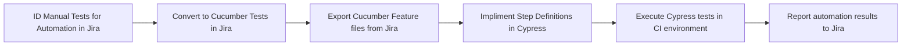

<!-- PROJECT LOGO -->
 

  <picture>
    <source media="(prefers-color-scheme: dark)" srcset="https://github.com/random-knights/.github/blob/main/assets/ReadMe-Night.png">
    <source media="(prefers-color-scheme: light)" srcset="https://github.com/random-knights/.github/blob/main/assets/ReadMe-Day.png">
    
  </picture>

<h3 align="center" style="color:#ff4124">Random Knights, XYZ</h3>

  

    randomly.engineering @ rand0m.ai
     
    <a href="https://github.com/random-knights/.github/blob/main/READMORE"><strong>Explore the docs »</strong></a>
     
     
    <a href="https://github.com/random-knights/random_demo">View Demo</a>
    ·
    <a href="https://github.com/random-knights/random_bug/issues">Report Bug</a>
    ·
    <a href="https://github.com/random-knights/random_feature/issues">Request Feature</a>
  

## <u> **ABOUT ME** </u>

👋 I’m an Eng1neer, but you can call me Steve! [randomly.engineering:](https://randomly.engineering) @random-knights

- 🖥️ Eng1eer @qa-steve by Day 🌝 VCM and [Rand0m.AI](https://random.ai)
- 💻 Deve10per @dev-kitt by Night 🌚 [Random Knights, XYZ](https://randomknights.xyz)

**Certified Scrum Master®, Automation Engineer, Daily Software Quality Assurance Expert**, and **ɯ0puɐɹ Knightly deve10per** specializing in Automation Architecture, Test Strategy and Planning, Documentation, QA/TDD/BDD Methodologies with a strong focus in Product Design, Development & Engineering, Creativity and Critical-Thinking, Problem Solving, Cross-System Integrations, Agile/Scrum with full SDLC coverage.

- 🌝 by Day 🏫 Agent of Change:
  - 🦡 aut0mate `cypress run --group aut0mated-test`
  - 🐈‍⬛ devel0per `int getRandomNumber() {Return 404;}`
  - 🦫 eng1neer `#define TRUE FALSE`
  - 🦝 expl0rer `Ctrl + Shift + Delete`
  - 🐀 test1ng `result = experiment() ??`

<small>\*\*names are pseudonyms; anonymity is requested\*\*</small>

<!-- RABBIT HOLE -->

##  **AWARDS, SKILLS & HIGHLIGHTS** 

Highly organized and detail-oriented Senior QA Engineer with a proven track record in designing, developing,
automating, and executing test plans within CI/CD workflows across Desktop, Web, Mobile, API, Database,
Performance, and Hardware/Firmware testing. Versatile in adapting to project-specific tooling and languages,
with a strong sense of ownership and collaboration within global, distributed teams. Skilled in high-quality
release train engineering using Agile/Scrum and BDD frameworks to deliver consistent results.

### **Certifications & Training** (2015-PRESENT)

👑 Software QA Engineer | Test Automation 12+YRS

- in **Global Carbon Trading Markets** | 2023-Now
- in Crypto Trading Markets | 2021-2023
- in C-Store Service Industry | 2019-2021
- in Commodities Trading Markets | 2015-2019
- in QS-Restaurant Service Industry | 2014-2015

---

- **ScrumAlliance®** — Certified Scrum Master (CSM®) _(2020–Present)_
- **HarvardX / MIT** — CS50: Introduction to Computer Science
- **Deque University** — Web Accessibility Curriculum 2.0 (IAAP) · ADA Certified Training
- **SmartBear Community**
  - 3× Leader of the Quarter _(’22 Q3 · ’22 Q4 · ’23 Q1)_
  - 2022 Hero Nominee
- **SmartBear Academy** — #4 Worldwide Leaderboard _(2023)_\*\*
- **SmartBear Certifications**
  - TestComplete · Zephyr · Swagger · ReadyAPI · Bugsnag · CucumberStudio · LoadNinja
- **Coursera Certificates**
  - Python · ARCore · Git/GitHub · Python with OS Interaction
- **Programming Hub**
  - Python _(x5: Core, Advanced, ML, AI)_
  - Django · Flask · Computer Vision · Flutter · Dart

<small>\*\*record previously held</small>

(<a href="#readme-top">back to top</a>)

<!-- WORKFLOWS -->

## <u> **WORKFLOWS** </u>

**Xray <> Cucumber** <small>demo only</small>

<small>\*\*implimentation details coming soon</small>

## <u> **WORKSPACE** </u>

### **PC**

[![Windows][Windows]][Windows-url]
[![Nvidia][Nvidia]][Nvidia-url]
[![Ryzen][Ryzen]][Ryzen-url]

### **IDE**

[![VSCode][VSCode]][VSCode-url]

### **Source Control**

[![GitHub][GitHub]][GitHub-url]
[![Git][Git]][Git-url]

### **Database**

[![MongoDB][MongoDB]][MongoDB-url]
[![PostgreSQL][PostgreSQL]][PostgreSQL-url]

### **Development**

[![Node.js][Node.js]][Node-url]
[![Python][Python]][Python-url]
[![JavaScript][JavaScript]][JavaScript-url]
[![TypeScript][TypeScript]][TypeScript-url]

### **Testing**

[![Chai.js][Chai.js]][Chai-url]
[![Cucumber][Cucumber]][Cucumber-url]
[![Cypress.js][Cypress.js]][Cypress-url]
[![Jest][Jest]][Jest-url]
[![Lighthouse][Lighthouse]][Lighthouse-url]
[![Mocha.js][Mocha.js]][Mocha-url]
[![Swagger.js][Swagger.js]][Swagger-url]
[![TestLibrary][TestLibrary]][TestLibrary-url]

### **Design**

[![AdobeIllustrator][AdobeIllustrator]][Illustrator-url]
[![Canva][Canva]][Canva-url]
[![Figma][Figma]][Figma-url]

### **Pipelines**

[![Slack][Slack]][Slack-url]
[![CypressCloud][CypressCloud]][CypressCloud-url]

(<a href="#readme-top">back to top</a>)

<!-- MARKDOWN LINKS & IMAGES -->
<!-- https://www.markdownguide.org/basic-syntax/#reference-style-links -->
<!-- DAY PALETTE GRADIENT PATCH -->
<!-- #ff4124 #faafa5 #fadfdb #b1fec8 -->

[contributors-shield]: https://img.shields.io/github/contributors/repo_name.svg?style=for-the-badge
[contributors-url]: https://github.com/random-knights/random-graphs/contributors
[forks-shield]: https://img.shields.io/github/forks/repo_name.svg?style=for-the-badge
[forks-url]: https://github.com/random-knights/random-network/members
[stars-shield]: https://img.shields.io/github/stars/repo_name.svg?style=for-the-badge
[stars-url]: https://github.com/random-knights/stargazers
[issues-shield]: https://img.shields.io/github/issues/repo_name.svg?style=for-the-badge
[issues-url]: https://github.com/random-knights/random-issues
[license-shield]: https://img.shields.io/github/license/repo_name.svg?style=for-the-badge
[license-url]: https://github.com/random-knights/random/blob/master/LICENSE.txt
[linkedin-shield]: https://img.shields.io/badge/LinkedIn-0A66C2?style=for-the-badge&logo=linkedin&logoColor=white
[linkedin-url]: https://linkedin.com/qa-kitt
[product-gif]: https://github.com/random-knights/random/blob/main/src/assets/rubicon.gif

<!-- WORKSPACE (C1: ff4124) -->

[Nvidia]: https://img.shields.io/badge/NVIDIA-RTX3060-ff4124?style=for-the-badge&logo=nvidia&logoColor=white
[Nvidia-url]: https://www.nvidia.com/en-us/
[Ryzen]: https://img.shields.io/badge/AMD-Ryzen_7_5800H-ff4124?style=for-the-badge&logo=amd&logoColor=white
[Ryzen-url]: https://www.amd.com/en/processors/ryzen
[Windows]: https://img.shields.io/badge/Windows-Lenovo_Legion-ff4124?style=for-the-badge&logo=windows&logoColor=white
[Windows-url]: https://www.lenovo.com/us/en/
[Macbook]: https://img.shields.io/badge/Apple-MacBook_Pro_2022-000000?style=for-the-badge&logo=apple&logoColor=white
[Macbook-url]: https://www.apple.com/macbook-pro/

<!-- IDE (C1: ff4124) -->

[VSCode]: https://img.shields.io/badge/Visual_Studio_Code-ff4124?style=for-the-badge&logo=visualstudiocode&logoColor=white
[VSCode-url]: https://code.visualstudio.com/

<!-- SOURCE CONTROL (C2: faafa5) -->

[GitHub]: https://img.shields.io/badge/GitHub-faafa5?style=for-the-badge&logo=github&logoColor=white
[GitHub-url]: https://github.com/
[GitHubActions]: https://img.shields.io/badge/GitHub_Actions-faafa5?style=for-the-badge&logo=github-actions&logoColor=white
[GitHubActions-url]: https://github.com/features/actions
[Git]: https://img.shields.io/badge/Git-faafa5?style=for-the-badge&logo=git&logoColor=white
[Git-url]: https://git-scm.com/

<!-- DATABASE (C2: faafa5) -->

[MongoDB]: https://img.shields.io/badge/MongoDB-faafa5?style=for-the-badge&logo=mongodb&logoColor=white
[MongoDB-url]: https://www.mongodb.com/
[PostgreSQL]: https://img.shields.io/badge/PostgreSQL-faafa5?style=for-the-badge&logo=postgresql&logoColor=white
[PostgreSQL-url]: https://www.postgresql.org/
[Hive]: https://img.shields.io/badge/Hive-faafa5?style=for-the-badge&logo=apachehive&logoColor=black
[Hive-url]: https://pub.dev/packages/hive

<!-- TOOLS (C2: faafa5) -->

[AdobeAudition]: https://img.shields.io/badge/Adobe_Audition-faafa5?style=for-the-badge&logo=adobeaudition&logoColor=white
[AdobePodcast]: https://img.shields.io/badge/Adobe_Podcast-faafa5?style=for-the-badge&logo=adobe&logoColor=white
[TeenageEngineeringMic]: https://img.shields.io/badge/Teenage_Engineering-CM--15_Mic-faafa5?style=for-the-badge&logoColor=white
[NothingHeadphones]: https://img.shields.io/badge/Nothing-Headphone_%281%29-faafa5?style=for-the-badge&logoColor=white

<!-- DEVELOPMENT (C3: fadfdb) -->

[JavaScript]: https://img.shields.io/badge/JavaScript-fadfdb?style=for-the-badge&logo=javascript&logoColor=black
[JavaScript-url]: https://www.javascript.com/
[Node.js]: https://img.shields.io/badge/Node.js-fadfdb?style=for-the-badge&logo=node.js&logoColor=white
[Node-url]: https://nodejs.org/
[Python]: https://img.shields.io/badge/Python-fadfdb?style=for-the-badge&logo=python&logoColor=white
[Python-url]: https://www.python.org/
[TypeScript]: https://img.shields.io/badge/TypeScript-fadfdb?style=for-the-badge&logo=typescript&logoColor=white
[TypeScript-url]: https://www.typescriptlang.org/
[Flutter]: https://img.shields.io/badge/Flutter-fadfdb?style=for-the-badge&logo=flutter&logoColor=white
[Flutter-url]: https://flutter.dev/
[Dart]: https://img.shields.io/badge/Dart-fadfdb?style=for-the-badge&logo=dart&logoColor=white
[Dart-url]: https://dart.dev/

<!-- TESTING (C3: fadfdb) -->

[Chai.js]: https://img.shields.io/badge/Chai-fadfdb?style=for-the-badge&logo=chai&logoColor=white
[Chai-url]: https://www.chaijs.com/
[Cucumber]: https://img.shields.io/badge/Cucumber-fadfdb?style=for-the-badge&logo=cucumber&logoColor=white
[Cucumber-url]: https://cucumber.io/
[Cypress.js]: https://img.shields.io/badge/Cypress-fadfdb?style=for-the-badge&logo=cypress&logoColor=white
[Cypress-url]: https://www.cypress.io/
[Jest]: https://img.shields.io/badge/Jest-fadfdb?style=for-the-badge&logo=jest&logoColor=white
[Jest-url]: https://jestjs.io/
[Lighthouse]: https://img.shields.io/badge/Lighthouse-fadfdb?style=for-the-badge&logo=lighthouse&logoColor=white
[Lighthouse-url]: https://developer.chrome.com/docs/lighthouse/
[Mocha.js]: https://img.shields.io/badge/Mocha-fadfdb?style=for-the-badge&logo=mocha&logoColor=white
[Mocha-url]: https://mochajs.org/
[Swagger.js]: https://img.shields.io/badge/Swagger-fadfdb?style=for-the-badge&logo=swagger&logoColor=black
[Swagger-url]: https://swagger.io/
[TestLibrary]: https://img.shields.io/badge/Testing_Library-fadfdb?style=for-the-badge&logo=testing-library&logoColor=white
[TestLibrary-url]: https://testing-library.com/

<!-- DESIGN (C4: b1fec8) -->

[AdobeIllustrator]: https://img.shields.io/badge/Adobe_Illustrator-b1fec8?style=for-the-badge&logo=adobeillustrator&logoColor=black
[Illustrator-url]: https://www.adobe.com/products/illustrator.html
[Canva]: https://img.shields.io/badge/Canva-b1fec8?style=for-the-badge&logo=canva&logoColor=white
[Canva-url]: https://www.canva.com/
[Figma]: https://img.shields.io/badge/Figma-b1fec8?style=for-the-badge&logo=figma&logoColor=white
[Figma-url]: https://www.figma.com/
[Framer]: https://img.shields.io/badge/Framer-b1fec8?style=for-the-badge&logo=framer&logoColor=blue
[Framer-url]: https://www.framer.com/

<!-- PIPELINE (C4: b1fec8) -->

[Slack]: https://img.shields.io/badge/Slack-b1fec8?style=for-the-badge&logo=slack&logoColor=white
[Slack-url]: https://www.slack.com/
[CypressCloud]: https://img.shields.io/badge/Cypress_Cloud-b1fec8?style=for-the-badge&logo=cypress&logoColor=white
[CypressCloud-url]: https://www.cypress.io/
[Firebase]: https://img.shields.io/badge/Firebase-b1fec8?style=for-the-badge&logo=firebase&logoColor=black
[Firebase-url]: https://firebase.google.com/

<!-- AI (C4: b1fec8) -->

[ChatGPT]: https://img.shields.io/badge/ChatGPT-b1fec8?style=for-the-badge&logo=openai&logoColor=white
[ChatGPT-url]: https://chatgpt.com/
[Gemini]: https://img.shields.io/badge/Gemini-b1fec8?style=for-the-badge&logo=google&logoColor=white
[Gemini-url]: https://gemini.google.com/
[Claude]: https://img.shields.io/badge/Claude-b1fec8?style=for-the-badge&logo=anthropic&logoColor=white
[Claude-url]: https://www.anthropic.com/
[RabbitTech]: https://img.shields.io/badge/Rabbit.Tech-FF4124?style=for-the-badge
[RabbitTech-url]: https://www.rabbit.tech/
[Perplexity]: https://img.shields.io/badge/Perplexity-b1fec8?style=for-the-badge&logo=perplexity&logoColor=white
[Perplexity-url]: https://www.perplexity.ai/
[Rand0mAI]: https://img.shields.io/badge/Rand0m.AI-FF4124?style=for-the-badge
[Rand0mAI-url]: https://rand0m.ai/

